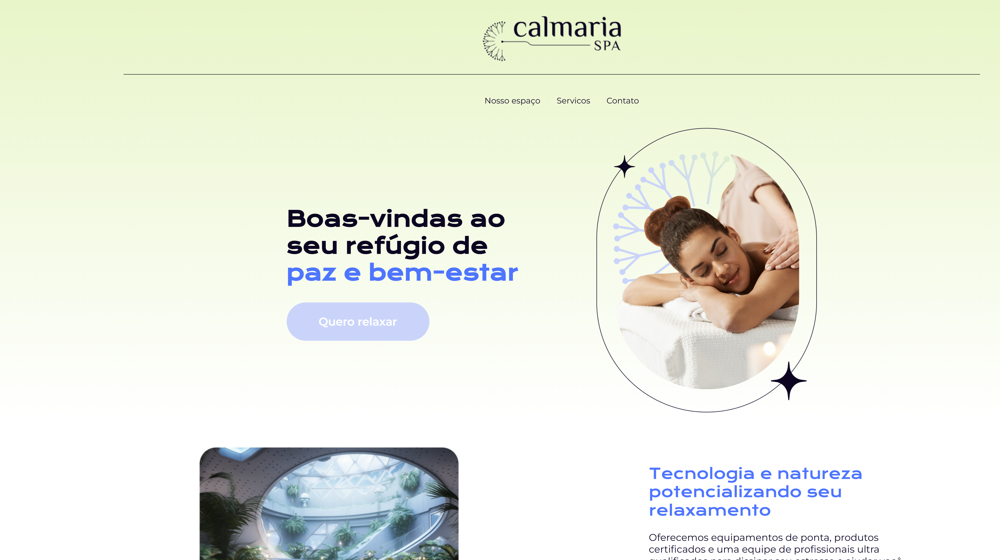

# Frontend Mentor - Four card feature section solution

Calmaria SPA is a solution to the [SASS e CSS: estilizando um site](https://cursos.alura.com.br/course/sass-css-estilizando-site). The structure was pre-assembled so that the lessons' tasks were focused on applying the SASS preprocessor resources.
## Table of contents

- [Overview](#verview)
  - [The lesson](#what-i-learned)
  - [Screenshot](#screenshot)
  - [Links](#links)
- [My process](#my-process)
  - [Built with](#built-with)
- [Author](#author)

## Overview

### What I learned

Users should be able to:

Use the SASS preprocessor resources in their projects.

Create easy-to-read stylesheets.

Write reusable code with mixins, @extend, and the parent selector.

Modularize stylesheets using partials.

Use variables for colors and layout adjustments on a landing page (website).

Perform mathematical operations to build layouts.

### Screenshot

### Links

- Solution URL: [Calmaria Spa on GitHub]()
- Live Site URL: [Calmaria Spa on VERCEL]()

## My process

"In summary, I started by installing, applying, and testing the functionality of Sass in the project.  
Afterward, I created the header stylesheets and applied the variables. Then, we organized the `_root` with the base structure of the project and the `_variaveis` with all the variables used in the project. Next, I modularized the files and organized them into components and abstracts. In the header component, I replaced the values with variables. We worked with `@include`, `@use`, `@extend`, and `&:nth-child` in each section."

### Built with

- Sass
- CSS custom properties
- CSS Grid
- CSS Flexbox

## Author

- Website - [Mariana Candido - M4R0C4](https://github.com/M4R0C4)
- Frontend Mentor - [@M4R0C4](https://www.frontendmentor.io/profile/M4R0C4)
- LinkedIn - [Mariana Candido](https://www.linkedin.com/in/mariana-candido-20b59b88/)

